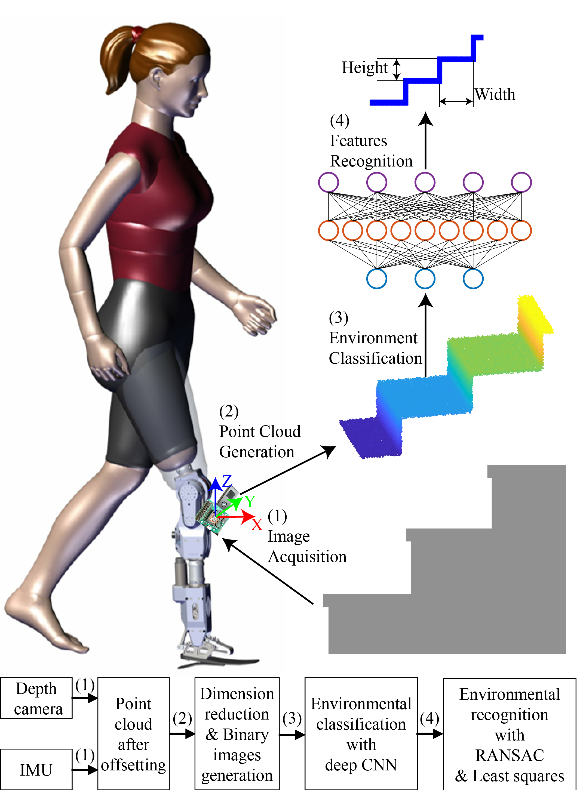

# Environmental features recognition for lower limb prostheses toward predictive walking



We present a robust environmental features recognition system (EFRS) for lower limb prosthesis,
which can assist the control of prosthesis by predicting locomotion modes of amputees and estimating environmental features in the following steps. A depth sensor and an inertial measurement unit (IMU) are combined to stabilize
the point cloud of environments. Subsequently, the 2D point cloud is extracted from origin 3D point cloud and is classified through a neural network. Environmental features, including slope of road, width,
and height of stair, were also estimated via the 2D point cloud. Finally, EFRS is evaluated through classifying and recognizing five kinds of common environments in simulation, indoor experiments and outdoor
experiments by six healthy subjects and three transfemoral amputees, and databases of five healthy subjects and
three amputees are used to validate without training. The classification accuracy of five kinds of common environments reach up to 99.3% and 98.5% for the amputees in the indoor and outdoor experiments, respectively. The locomotion modes are predicted at least 0.6 s before the switch of actual locomotion modes. Most estimation errors
of indoor and outdoor environments features are lower than 5% and 10%, respectively. The overall process of EFRS takes less than 0.023 s. The promising results demonstrate the robustness and the potential application of the presented EFRS to help control of lower limb prostheses. 

This repository includes 2D binary image dataset and a CNN model based on Keras.  You can test and train the model directly by running the file: classification.py.

## Run

```bash
python classification.py
```

I just uploaded the environmental classification algorithm because I think it should be the most useful part. If you want me to upload the image preprocessing and environmental parameter estimation part, please leave a message in the issue or send an email to me directly. 

## Contact

For more related works and codes, please view my homepage: https://sites.google.com/view/kuangenzhang

Further information please contact Kuangen Zhang (kuangen.zhang@alumni.ubc.ca).

## Citation
If you find our work useful in your research, please consider citing:
```bash
@article{zhang_environmental_2019,
	title = {Environmental features recognition for lower limb prostheses toward predictive walking},
	volume = {27},
	issn = {1534-4320},
	number = {3},
	journal = {IEEE Transactions on Neural Systems and Rehabilitation Engineering},
	author = {Zhang, K. and Xiong, C. and Zhang, W. and Liu, H. and Lai, D. and Rong, Y. and Fu, C.},
	month = mar,
	year = {2019}
}
```


## License
MIT License
